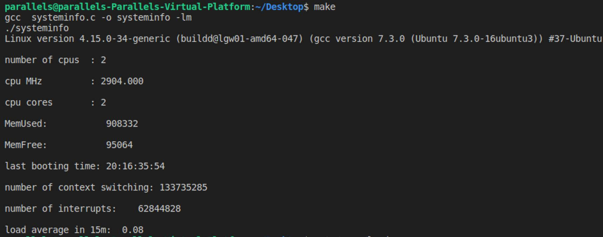

# 1. process_signal

## 리눅스 운영체제에서 프로세스 실행 / 종료를 자동으로 관리하는 프로그램의 추가 기능을 구현

C 언어와 glibc API만 이용하여 ‘procman.c’소스 파일에서 모든 기능을 구현

sigaction()대신 signalfd()를 이용해서 SIGCHLD시그널을 처리

프로그램 실행 정보 : “id:action:order:pipe-id:command”

- id : 영문 소문자와 숫자 2개 이상 8개 이하로 구성된 프로그램 고유 ID (중복 허용 안 함)

- action : 프로그램 동작 방식 (반드시 다음 중 하나)

-once : 프로그램 실행 후 바로 다음 프로그램 실행

-respawn : 프로그램 실행 후 바로 다음 프로그램 실행하고, 종료되면 다시 재실행

- order : 프로그램 실행 순서, 4자리 이하 숫자로 구성되면 중복시 상위 행에 기술된 프로그램

- pipe-id : 파이프(pipe)로 연결할 프로그램 ID (없을 경우 비워둠)

- command : 인수를 포함한 프로그램 실행 명령어 (프로그램 경로는 상대 / 절대 경로 가능)

# 2.multilevel_queue_scheduling

텍스트 형식의 프로세스 스케줄링 목록 입력 파일을 프로그램 첫 번째 인수로 받아들여 처리. 

프로세스 스케줄링 목록 정보를 기반으로 다단계 큐 스케줄링(Multilevel Queue Scheduling) 시뮬레이션 결과를 표준입력(stdout) 장치로 출력합니다. 

오류가 있을 경우 표준에러(stderr) 장치로 에러 메시지를 출력하고 해당 행은 무시. 

  

# 3.dining_philosophers_with_semaphore

 pthread 라이브러리를 이용하여 Dining Philosophers 문제를 구현.

세마포어 값(value) 접근시 pthread_mutex  API와 같은 상호 배제 기법 쓰레드 목록을 직접 유지하는 방식 또는 phtread_cond_() API를 사용해서 구현. 

프로그램 실행 정보 : "<number of philosophers> <number of msec> <number of think-eat cycles>"

- Number of philosophers : 철학자의 수(3~10사이 정수) 

- Number of msec : thinking 또는 eating 시간(10~1000사이 정수) 

- Number of think-eat cycles : 프로그램 종료 시까지 thinking-eating 사이클 수(1~100사이 정수) 

# 4.access_system_info

/proc 파일 시스템에 제공하는 커널 정보 또는 프로세스 정보를 출력한다. 

1. 리눅스 커널 버전 2. 시스템의 CPU 갯수, 클럭 속도, 코어의 갯수 3. 시스템의 사용중인 메모리 및 사용 가능한 메모리 4. 시스템이 마지막으로 부팅된 시간(day:hr:min:sec) 5. 문맥 교환 개수 6. 인터럽트 개수 7. 최근 15분 동안 부하 평균.

# 5.memory_mapping

메모리 맵 파일(mmap)을 이용하여 프로세스간 자료를 공유하고, 자료가 변경되었을 경우 시그널을 이용 해 다른 프로세스에게 알려주는 프로그램을 구현.

 $ **./student** 

usage: ./student [-f file][-s value] attr_name 

-f file : 공유할 파일 이름, 지정하지 않을 경우 './student.dat' 

-s value : 지정한 'attr_name' 에 대한 값(value) 변경, 지정하지 않을 경우 값 출력 

